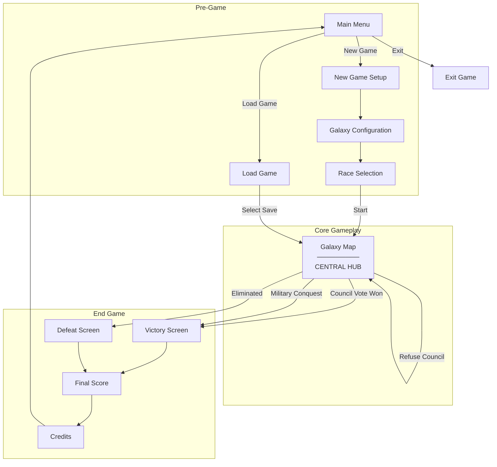
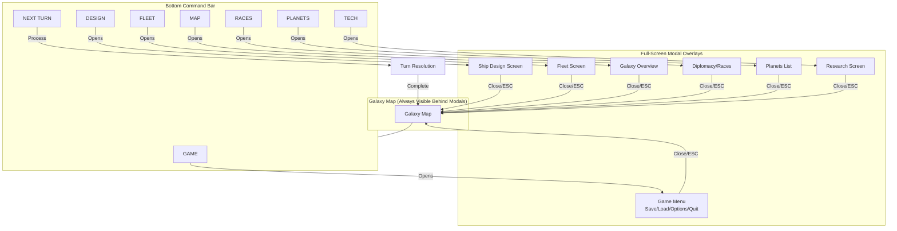
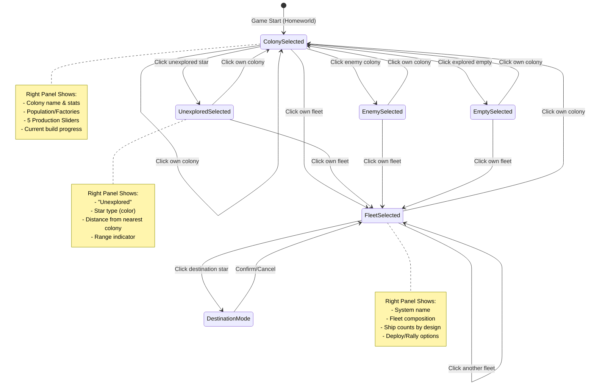
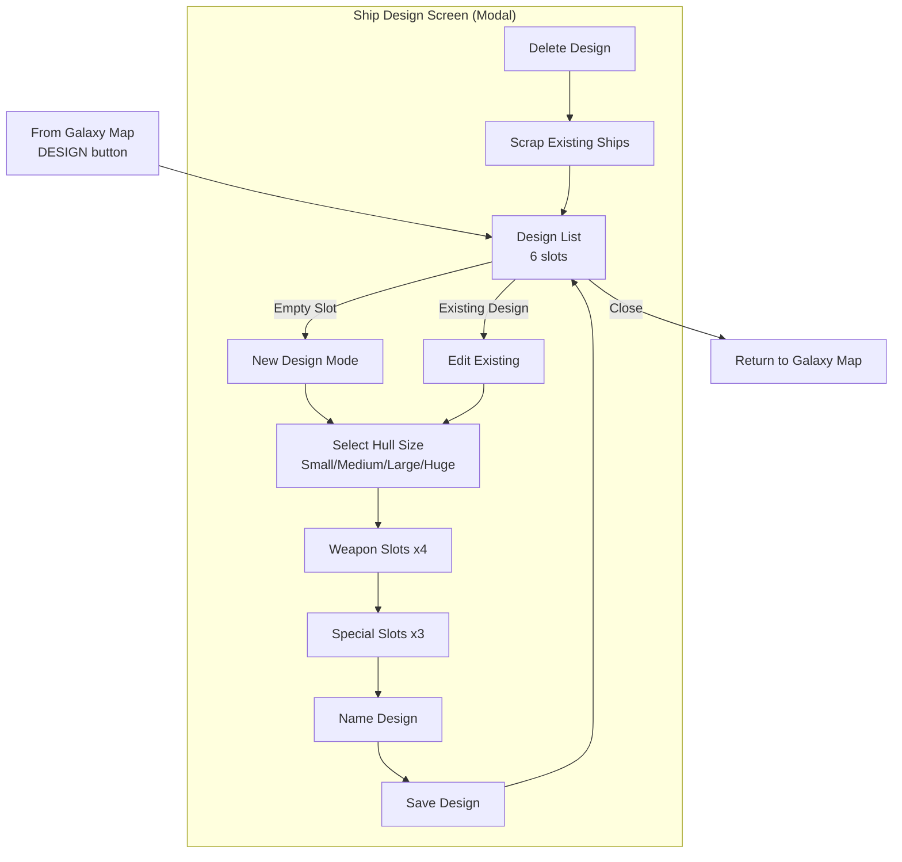
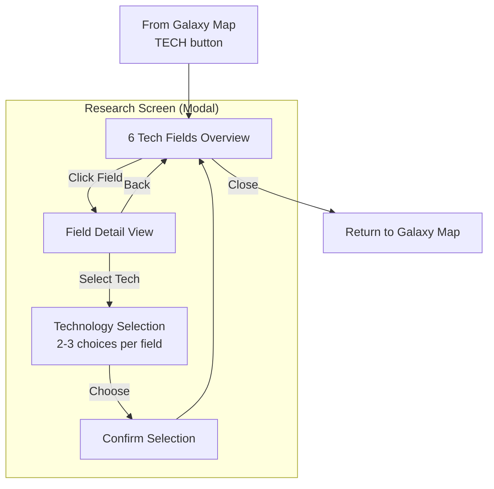
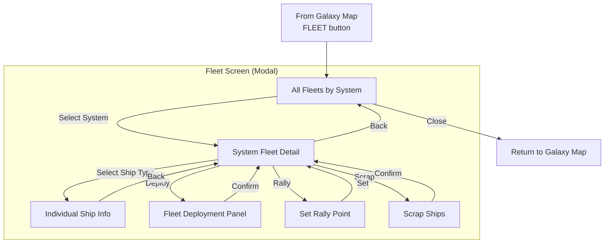
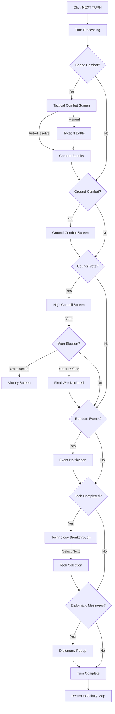
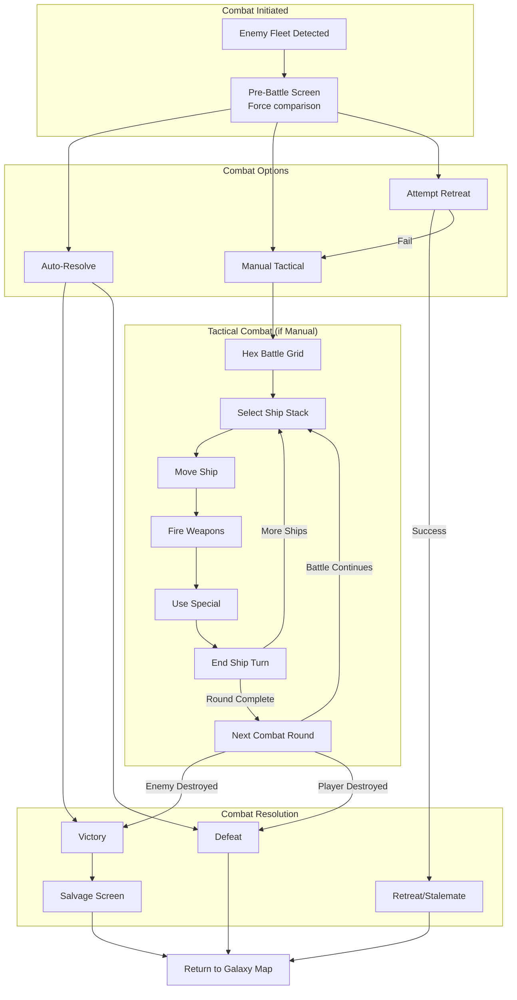

# Hamster of Orion - UI Navigation Flow

## Overview

This document defines the complete screen navigation flow for Hamster of Orion, based on MOO1's interface structure. The game uses a **hub-and-spoke model** where the Galaxy Map is the central hub, with all other screens accessible as modal overlays or sub-screens.

---

## 1. High-Level Game Flow



---

## 2. Galaxy Map - Central Hub

The Galaxy Map is the primary gameplay screen. All other screens are accessed from here via the **bottom command bar** or by clicking on game elements.



---

## 3. Galaxy Map - Selection States

The right panel of the Galaxy Map changes based on what's selected. In MOO1, something is ALWAYS selected (starts with homeworld).



---

## 4. Modal Screen Details

### 4.1 Ship Design Screen Flow



### 4.2 Research Screen Flow



### 4.3 Diplomacy Screen Flow


### 4.4 Fleet Screen Flow



---

## 5. Turn Resolution Flow

When "NEXT TURN" is clicked, a sequence of events may require player input:



---

## 6. Combat Screen Flow



---

## 7. Screen Hierarchy Summary

```
MAIN MENU
├── New Game
│   ├── Galaxy Setup
│   └── Race Selection → GALAXY MAP
├── Load Game → GALAXY MAP
├── Options
└── Exit

GALAXY MAP (Central Hub)
├── [Click Colony] → Right Panel: Colony View + Sliders
├── [Click Fleet] → Right Panel: Fleet View + Deploy
├── [Click Star] → Right Panel: Star Info
│
├── GAME → Game Menu Modal
│   ├── Save Game
│   ├── Load Game
│   ├── Options
│   └── Quit to Menu
│
├── DESIGN → Ship Design Modal
│   ├── View 6 Design Slots
│   ├── Create New Design
│   ├── Edit Design
│   └── Delete Design
│
├── FLEET → Fleet Screen Modal
│   ├── All Fleets List
│   ├── System Details
│   └── Deployment Panel
│
├── MAP → Galaxy Overview Modal
│   └── Zoomed out view
│
├── RACES → Diplomacy Modal
│   ├── Race List
│   ├── Race Details
│   └── Audience/Negotiations
│
├── PLANETS → Planets List Modal
│   ├── All Colonies
│   └── Colony Quick-Edit
│
├── TECH → Research Modal
│   ├── 6 Field Overview
│   └── Tech Selection
│
└── NEXT TURN → Turn Resolution
    ├── Combat (if any)
    ├── Council (if triggered)
    ├── Events (random)
    ├── Tech Breakthroughs
    └── Diplomatic Messages

VICTORY/DEFEAT
├── Victory Screen
├── Defeat Screen
├── Final Score
└── Return to Main Menu
```

---

## 8. Key Navigation Principles (MOO1-Faithful)

1. **Galaxy Map is always "home"** - All modals return to it
2. **Something is always selected** - No empty/null selection state
3. **Bottom command bar only on Galaxy Map** - Modals have their own close buttons
4. **ESC closes current modal** - Returns to Galaxy Map
5. **Right-click = context menu** (optional enhancement over MOO1)
6. **Turn resolution is sequential** - Events processed in order with player input as needed
7. **No nested modals** - One modal at a time over Galaxy Map

---

## 9. Keyboard Shortcuts

| Key | Galaxy Map Action | In Modals |
|-----|------------------|-----------|
| `G` | GAME menu | - |
| `D` | DESIGN screen | - |
| `F` | FLEET screen | - |
| `M` | MAP overview | - |
| `R` | RACES/Diplomacy | - |
| `P` | PLANETS list | - |
| `T` | TECH/Research | - |
| `Enter` | NEXT TURN | Confirm |
| `ESC` | - | Close modal |
| `1-4` | - | Select hull (Design) |
| `Space` | Center on selection | - |

---

*Next: See `wireframes/` folder for detailed screen layouts.*
