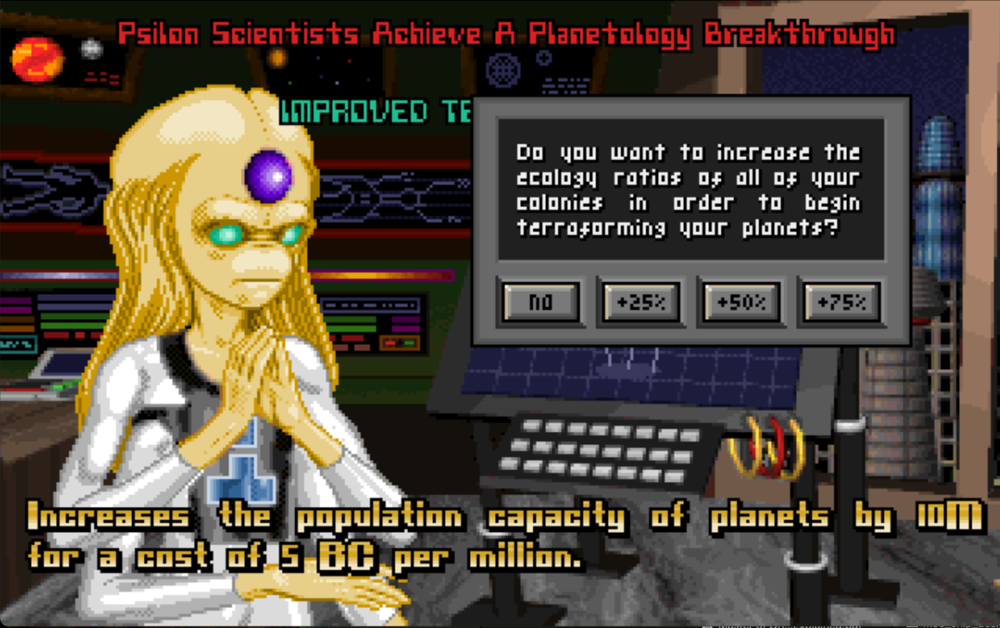
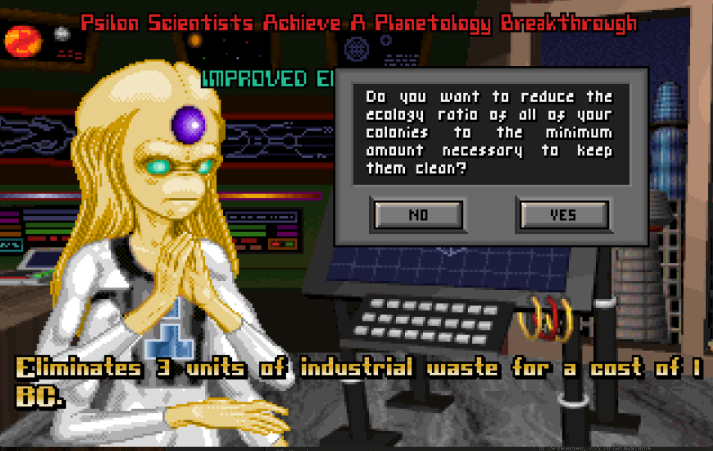

# UI State Transitions Specification

## Overview

This document specifies all UI screen transitions, modal behaviors, popup triggers, confirmation dialogs, and turn flow state machines for Hamster of Orion, matching Master of Orion (1993) patterns with modern web enhancements.

**Reference**: MOO1 (1993) screen flow, existing HoO UI documentation  
**Related Docs**: `interaction-spec.md`, `main-screens.md`, `UI_OVERVIEW.md`  
**Version**: 1.0  
**Last Updated**: 2026-03-22

---

## Table of Contents

1. [Master Screen Flow Diagram](#1-master-screen-flow-diagram)
2. [Screen State Machine](#2-screen-state-machine)
3. [Turn Flow State Machine](#3-turn-flow-state-machine)
4. [Modal and Popup System](#4-modal-and-popup-system)
5. [Screen Transition Specifications](#5-screen-transition-specifications)
6. [Confirmation Dialog Requirements](#6-confirmation-dialog-requirements)
7. [Notification and Alert System](#7-notification-and-alert-system)
8. [Game Phase Transitions](#8-game-phase-transitions)
9. [Combat State Machine](#9-combat-state-machine)
10. [Loading and Save States](#10-loading-and-save-states)
11. [Error and Recovery States](#11-error-and-recovery-states)
12. [JSON Data Structures](#12-json-data-structures)
13. [Animation and Timing](#13-animation-and-timing)
14. [Edge Cases](#14-edge-cases)

---

## 1. Master Screen Flow Diagram

### 1.1 High-Level Screen Flow (ASCII Diagram)

```
                              ┌─────────────────┐
                              │   TITLE SCREEN  │
                              │   (Main Menu)   │
                              └────────┬────────┘
                                       │
           ┌───────────────────────────┼───────────────────────────┐
           │                           │                           │
           ▼                           ▼                           ▼
    ┌──────────────┐          ┌──────────────┐           ┌──────────────┐
    │   NEW GAME   │          │  LOAD GAME   │           │   SETTINGS   │
    │    Setup     │          │   Dialog     │           │    Screen    │
    └──────┬───────┘          └──────┬───────┘           └──────────────┘
           │                         │
           ▼                         │
    ┌──────────────┐                 │
    │   GALAXY     │                 │
    │   SETTINGS   │                 │
    └──────┬───────┘                 │
           │                         │
           ▼                         │
    ┌──────────────┐                 │
    │    RACE      │                 │
    │  SELECTION   │                 │
    └──────┬───────┘                 │
           │                         │
           ├─────────────────────────┘
           │
           ▼
    ┌──────────────────────────────────────────────────────────────────────┐
    │                         GAME LOOP (Hub: Galaxy Map)                   │
    │                                                                       │
    │  ┌─────────┐   ┌─────────┐   ┌─────────┐   ┌─────────┐   ┌─────────┐ │
    │  │ GALAXY  │◄──┤ PLANETS │◄──┤  FLEET  │◄──┤RESEARCH │◄──┤  SHIP   │ │
    │  │   MAP   │──►│  (F2)   │──►│  (F3)   │──►│  (F4)   │──►│ DESIGN  │ │
    │  │  (F1)   │   └─────────┘   └─────────┘   └─────────┘   │  (F6)   │ │
    │  │  HUB    │◄──────────────────────────────────────────►│         │ │
    │  └────┬────┘   ┌─────────┐   ┌─────────┐   ┌─────────┐   └─────────┘ │
    │       │        │DIPLOMACY│   │ REPORTS │   │ COUNCIL │               │
    │       └───────►│  (F5)   │◄──┤  (F7)   │◄──┤  (F8)   │               │
    │                └─────────┘   └─────────┘   └─────────┘               │
    │                                                                       │
    │                         ┌─────────┐                                   │
    │         END TURN ──────►│  TURN   │──────► NOTIFICATIONS              │
    │         (Enter)         │PROCESSING│       & EVENTS                   │
    │                         └─────────┘                                   │
    └───────────────────────────────────────────────────────────────────────┘
                                       │
                    ┌──────────────────┼──────────────────┐
                    │                  │                  │
                    ▼                  ▼                  ▼
            ┌──────────────┐   ┌──────────────┐   ┌──────────────┐
            │   TACTICAL   │   │    HIGH      │   │   VICTORY/   │
            │   COMBAT     │   │   COUNCIL    │   │   DEFEAT     │
            │   (Modal)    │   │   VOTE       │   │   SCREEN     │
            └──────────────┘   └──────────────┘   └──────────────┘
```

### 1.2 Navigation Matrix

> **All main screens (F1–F7) support direct F-key navigation to each other.** ESC from any main screen returns to Galaxy Map (F1). True modals (Combat, Council Vote, Game Menu, start-of-turn popups) block F-key navigation. *(Modernization: QoL improvement over strict MOO1 — players can jump between screens without closing each one first.)*

| From Screen | F1 | F2 | F3 | F4 | F5 | F6 | F7 | Esc | Enter |
|-------------|----|----|----|----|----|----|----|----|-------|
| Galaxy Map (F1) | — | ✓ | ✓ | ✓ | ✓ | ✓ | ✓ | Menu | Turn |
| Planets (F2) | ✓ | — | ✓ | ✓ | ✓ | ✓ | ✓ | F1 | Turn |
| Fleet (F3) | ✓ | ✓ | — | ✓ | ✓ | ✓ | ✓ | F1 | Turn |
| Technology (F4) | ✓ | ✓ | ✓ | — | ✓ | ✓ | ✓ | F1 | Turn |
| Races (F5) | ✓ | ✓ | ✓ | ✓ | — | ✓ | ✓ | F1 | Turn |
| Ship Design (F6) | ✓ | ✓ | ✓ | ✓ | ✓ | — | ✓ | F1 | Turn |
| Tech (F7) | ✓ | ✓ | ✓ | ✓ | ✓ | ✓ | — | F1 | Turn |
| Game Menu (ESC) | ✗ | ✗ | ✗ | ✗ | ✗ | ✗ | ✗ | Close | ✗ |
| Council | ✗ | ✗ | ✗ | ✗ | ✗ | ✗ | ✗ | ✗ | Vote |
| Combat | ✗ | ✗ | ✗ | ✗ | ✗ | ✗ | ✗ | ✗** | ✗ |

**Legend:**
- ✓ = Direct navigation allowed
- ✗ = Navigation blocked (true modal — must be resolved first)
- True modals: Combat, Council Vote, Game Menu, start-of-turn popups
- Council only accessible when in session (event-triggered)
- Game Menu is a true modal opened by ESC; blocks all F-key navigation
- ✗** = Escape opens combat menu, not game menu

---

## 2. Screen State Machine

### 2.1 Core Screen States

```
┌─────────────────────────────────────────────────────────────────────────┐
│                          SCREEN STATE MACHINE                           │
└─────────────────────────────────────────────────────────────────────────┘

   ┌──────────────┐
   │   LOADING    │ ─────────────────────────────────┐
   └──────┬───────┘                                  │
          │ (assets loaded)                          │
          ▼                                          │
   ┌──────────────┐                                  │
   │    IDLE      │ ◄───────────────────────────┐    │
   │  (default)   │                             │    │
   └──────┬───────┘                             │    │
          │ (user action)                       │    │
          ▼                                     │    │
   ┌──────────────┐     ┌──────────────┐        │    │
   │  PROCESSING  │────►│   WAITING    │        │    │
   │  (animation) │     │  (AI/server) │        │    │
   └──────┬───────┘     └──────┬───────┘        │    │
          │                    │                │    │
          ├────────────────────┘                │    │
          ▼                                     │    │
   ┌──────────────┐     ┌──────────────┐        │    │
   │  MODAL_OPEN  │────►│CONFIRMATION  │        │    │
   │  (dialog)    │◄────│  PENDING     │        │    │
   └──────┬───────┘     └──────────────┘        │    │
          │                                     │    │
          │ (modal closed)                      │    │
          └─────────────────────────────────────┘    │
                                                     │
   ┌──────────────┐                                  │
   │    ERROR     │ ◄────────────────────────────────┘
   │   (error)    │                (error thrown)
   └──────────────┘
```

### 2.2 State Definitions

```json
{
  "screenStates": {
    "LOADING": {
      "description": "Screen assets and data loading",
      "allowsInput": false,
      "showsSpinner": true,
      "timeout": 10000,
      "onTimeout": "ERROR"
    },
    "IDLE": {
      "description": "Ready for user input",
      "allowsInput": true,
      "allowsNavigation": true,
      "allowsShortcuts": true
    },
    "PROCESSING": {
      "description": "Executing user action with animation",
      "allowsInput": false,
      "showsAnimation": true,
      "duration": "variable",
      "onComplete": "IDLE"
    },
    "WAITING": {
      "description": "Waiting for AI or server response",
      "allowsInput": false,
      "showsSpinner": true,
      "timeout": 30000,
      "onTimeout": "ERROR"
    },
    "MODAL_OPEN": {
      "description": "True modal dialog is displayed (Combat, Council, Game Menu, start-of-turn popups). Main screens (F1-F7) are NOT modal_open state — they are IDLE with full F-key navigation.",
      "allowsInput": true,
      "inputScope": "modal_only",
      "allowsNavigation": false,
      "escapeBehavior": "close_modal"
    },
    "CONFIRMATION_PENDING": {
      "description": "Awaiting user confirmation",
      "allowsInput": true,
      "inputScope": "dialog_only",
      "requiresResponse": true
    },
    "ERROR": {
      "description": "Error state with recovery options",
      "allowsInput": true,
      "inputScope": "error_dialog",
      "showsErrorDialog": true
    }
  }
}
```

### 2.3 Screen-Specific States

#### Galaxy Map States
```
GALAXY_MAP_STATES:
├── IDLE (default view)
├── STAR_SELECTED (star info panel open)
├── FLEET_SELECTED (fleet info panel, range circle)
├── SETTING_DESTINATION (click to set fleet destination)
├── ZOOMING (zoom animation in progress)
├── PANNING (drag/scroll pan in progress)
└── CONTEXT_MENU_OPEN (right-click menu visible)
```

**Visual References — Galaxy Map States:**

| State | Screenshot |
|-------|------------|
| IDLE |  — default idle view |
| STAR_SELECTED (unexplored) |  |
| STAR_SELECTED (uncolonized planet) |  |
| FLEET_SELECTED |  — fleet info panel with range ring |
| FLEET_SELECTED (in transit) |  |
| FLEET_SELECTED (deployment) |  |
| SETTING_DESTINATION |  — after destination chosen |
| SETTING_DESTINATION (out of range) |  |

#### Planet Management States
```
PLANET_STATES:
├── IDLE (viewing planet)
├── SLIDER_ADJUSTING (dragging production slider)
├── BUILDING_SELECTING (building selection modal)
├── SHIP_SELECTING (ship design selection modal)
├── TRANSFERRING_POP (population transfer modal)
└── NAVIGATING (animating to next/prev planet)
```

**Visual References — Planet Management States:**

| State / Condition | Screenshot |
|-------------------|------------|
| IDLE — new colony |  |
| IDLE — post-terraformed |  |
| IDLE — planet at population cap |  |
| IDLE — max factories built |  |

#### Combat States
```
COMBAT_STATES:
├── PRE_COMBAT (fleet comparison, options)
├── INITIATIVE_DISPLAY (showing turn order)
├── MOVEMENT_PHASE (selecting movement)
├── FIRING_PHASE (selecting weapons/targets)
├── RESOLUTION (damage animation)
├── RETREAT_ATTEMPT (retreat confirmation)
├── BOMBARDMENT (planetary attack options)
├── VICTORY (combat resolved, player won)
└── DEFEAT (combat resolved, player lost)
```

---

## 3. Turn Flow State Machine

> **Research — Two UI Moments (MOO1-Accurate):**
> - **Tech Screen (F4):** Player adjusts RP allocation sliders at any time during their turn. This is the main research screen.
> - **Tech Selection Popup (TECH_CHOICE):** Appears at **start of turn only**, after turn processing resolves research. When a field completes a tech, a full-screen popup offers 2–3 options for the next tech. No mid-turn tech picking.

> **Visual References — Turn Event Notifications:**
>
> | Event | Screenshot |
> |-------|------------|
> | Research complete |  |
> | Research complete + eco bonus |  |
> | Eco reduction from tech |  |
> | Research choice prompt (TECH_CHOICE) |  |
> | New planet revealed |  |
> | New ships completed |  |

### 3.1 Complete Turn Cycle

```
┌─────────────────────────────────────────────────────────────────────────┐
│                         TURN FLOW STATE MACHINE                         │
└─────────────────────────────────────────────────────────────────────────┘

              ┌─────────────────────────────────────────────┐
              │            PLAYER TURN (Active)             │
              │                                             │
              │  ┌─────────────────────────────────────┐    │
              │  │  • Manage planets (F2)              │    │
              │  │  • Issue fleet orders (F3)          │    │
              │  │  • Adjust research (F4)             │    │
              │  │  • Conduct diplomacy (F5)           │    │
              │  │  • Design ships (F6)                │    │
              │  │  • Review tech progress (F7)        │    │
              │  └─────────────────────────────────────┘    │
              │                                             │
              └───────────────────┬─────────────────────────┘
                                  │
                                  │ Player presses END TURN (Enter)
                                  ▼
                    ┌─────────────────────────────┐
                    │   TURN CONFIRMATION DIALOG  │
                    │                             │
                    │  "End Turn 15?"             │
                    │  Summary of pending actions │
                    │  Warnings (if any)          │
                    │                             │
                    │  [Cancel]    [End Turn]     │
                    └──────────────┬──────────────┘
                                   │
                        ┌──────────┴──────────┐
                        │                     │
                        ▼                     ▼
                    [Cancel]              [End Turn]
                        │                     │
                        ▼                     ▼
                Return to               ┌─────────────────┐
                Player Turn             │ TURN PROCESSING │
                                        │                 │
                                        │  Phases:        │
                                        │  1. Movement    │
                                        │  2. Combat      │
                                        │  3. Production  │
                                        │  4. Research    │
                                        │  5. Events      │
                                        │  6. AI Turns    │
                                        │  7. Diplomacy   │
                                        │  8. Council     │
                                        └────────┬────────┘
                                                 │
                    ┌────────────────────────────┼────────────────────────┐
                    │                            │                        │
                    ▼                            ▼                        ▼
           ┌──────────────┐            ┌──────────────┐         ┌──────────────┐
           │   COMBAT     │            │   EVENTS     │         │   COUNCIL    │
           │   TRIGGER    │            │   (Random)   │         │   SESSION    │
           └──────┬───────┘            └──────┬───────┘         └──────┬───────┘
                  │                           │                        │
                  ▼                           ▼                        ▼
           ┌──────────────┐            ┌──────────────┐         ┌──────────────┐
           │   TACTICAL   │            │   EVENT      │         │   VOTING     │
           │   COMBAT     │            │   DIALOG     │         │   SEQUENCE   │
           │   SCREEN     │            │   (Popup)    │         │              │
           └──────┬───────┘            └──────┬───────┘         └──────┬───────┘
                  │                           │                        │
                  └───────────────────────────┴───────────────┬────────┘
                                                              │
                                                              ▼
                                                 ┌────────────────────────┐
                                                 │   TURN NOTIFICATIONS   │
                                                 │                        │
                                                 │  Queue of events:      │
                                                 │  • Research complete   │
                                                 │  • Ships built         │
                                                 │  • Treaties offered    │
                                                 │  • War declared        │
                                                 │  • etc.                │
                                                 └───────────┬────────────┘
                                                             │
                                                             │ All notifications
                                                             │ acknowledged
                                                             ▼
                                                   Return to PLAYER TURN
                                                   (Turn N+1)
```

### 3.2 Turn Processing Phases

```json
{
  "turnPhases": [
    {
      "id": "MOVEMENT",
      "order": 1,
      "description": "Execute all fleet movement orders",
      "canTrigger": ["COMBAT", "EXPLORATION"],
      "duration": "50ms per fleet",
      "visualFeedback": "Fleet icons animate along paths"
    },
    {
      "id": "COMBAT",
      "order": 2,
      "description": "Resolve all combat encounters",
      "isInteractive": true,
      "canTrigger": ["TACTICAL_COMBAT_SCREEN"],
      "blocking": true
    },
    {
      "id": "PRODUCTION",
      "order": 3,
      "description": "Process all planet production",
      "canTrigger": ["SHIP_COMPLETE", "BUILDING_COMPLETE"],
      "duration": "10ms per planet"
    },
    {
      "id": "RESEARCH",
      "order": 4,
      "description": "Apply research points, check breakthroughs. If a field completes, triggers start-of-turn TECH_CHOICE popup.",
      "canTrigger": ["TECH_COMPLETE", "TECH_CHOICE"],
      "isInteractive": true,
      "notes": "TECH_CHOICE popup appears at START OF TURN only. Players pick next tech from 2-3 options. No mid-turn tech picking. Multiple fields completing triggers sequential popups."
    },
    {
      "id": "RANDOM_EVENTS",
      "order": 5,
      "description": "Roll for and trigger random events",
      "canTrigger": ["SPACE_MONSTER", "PLAGUE", "COMET", "REBELLION"],
      "isInteractive": true
    },
    {
      "id": "AI_TURNS",
      "order": 6,
      "description": "AI empires take their turns",
      "duration": "200ms per AI empire",
      "visualFeedback": "AI portraits shown in sequence"
    },
    {
      "id": "DIPLOMACY",
      "order": 7,
      "description": "AI diplomatic actions",
      "canTrigger": ["TREATY_OFFERED", "WAR_DECLARED", "AUDIENCE_REQUESTED"],
      "isInteractive": true
    },
    {
      "id": "COUNCIL_CHECK",
      "order": 8,
      "description": "Check if High Council should convene",
      "canTrigger": ["COUNCIL_SESSION"],
      "condition": "50% planets colonized OR 25 turns since last"
    },
    {
      "id": "CLEANUP",
      "order": 9,
      "description": "Population growth, morale, upkeep",
      "duration": "10ms"
    }
  ]
}
```

### 3.3 Turn End Confirmation Dialog

```
╔═══════════════════════════════════════════════════════════════════════╗
║                          END TURN 15?                                  ║
╠═══════════════════════════════════════════════════════════════════════╣
║                                                                        ║
║  Summary of pending actions:                                           ║
║                                                                        ║
║  ✓ 3 fleets will move to their destinations                           ║
║  ✓ 2 ships will complete construction (Sol III, Alpha II)             ║
║  ✓ Research "Plasma Cannon" continues (78% → 91%)                     ║
║  ✓ Trade income: +45 BC from 2 agreements                             ║
║                                                                        ║
║  ⚠️ WARNINGS:                                                          ║
║     • Border Fort has no defending fleet!                              ║
║     • Research allocation at 0% for Force Fields                       ║
║     • 3 planets have unspent production capacity                       ║
║                                                                        ║
╠═══════════════════════════════════════════════════════════════════════╣
║                                                                        ║
║  [☐] Don't show warnings in future                                     ║
║                                                                        ║
║                    [ Cancel ]           [ End Turn ⏎]                  ║
║                                                                        ║
╚═══════════════════════════════════════════════════════════════════════╝
```

**Dialog Behavior:**
- Shows automatically when player presses Enter/End Turn
- Summarizes all actions that will execute
- Highlights warnings for undefended colonies, idle production
- Can be disabled with checkbox (reverts to instant end turn)
- Enter key confirms, Escape cancels

---

## 4. Modal and Popup System

### 4.1 Modal Hierarchy

```
┌─────────────────────────────────────────────────────────────────────────┐
│                          MODAL LAYER STACK                              │
└─────────────────────────────────────────────────────────────────────────┘

  Z-Index    Layer                     Example
  ═══════    ═════                     ═══════
  
  1000       Critical Alerts           • Connection Lost
                                       • Fatal Error
                                       • Session Expired
                                       
   900       System Dialogs            • Save Confirmation
                                       • Exit Confirmation
                                       • Settings
                                       
   800       Game Events               • Research Complete
                                       • War Declared
                                       • Council Convened
                                       
   700       Combat                    • Tactical Combat Screen
                                       • Pre-Combat Options
                                       • Combat Results
                                       
   600       Confirmation Dialogs      • End Turn Confirmation
                                       • Scrap Fleet
                                       • Declare War
                                       
   500       Selection Modals          • Ship Design Select
                                       • Technology Choice
                                       • Treaty Selection
                                       
   400       Input Dialogs             • Rename Fleet
                                       • Set Rally Point
                                       
   300       Context Menus             • Right-click menus
                                       
   200       Tooltips                  • Hover information
                                       
   100       Notifications             • Turn summary items
                                       • Achievement popups
                                       
     0       Game Screen               • Galaxy Map, Planets, etc.
```

### 4.2 Modal Types and Behaviors

```json
{
  "modalTypes": {
    "BLOCKING": {
      "description": "Must be addressed before continuing",
      "dismissible": false,
      "escapeBehavior": "none",
      "clickOutsideBehavior": "none",
      "examples": ["Combat", "Council Vote", "Game Over"]
    },
    "CONFIRMATION": {
      "description": "Requires explicit yes/no decision",
      "dismissible": true,
      "escapeBehavior": "cancel",
      "clickOutsideBehavior": "cancel",
      "defaultButton": "cancel",
      "examples": ["End Turn", "Declare War", "Scrap Ships"]
    },
    "INFORMATION": {
      "description": "Displays information, single dismiss",
      "dismissible": true,
      "escapeBehavior": "dismiss",
      "clickOutsideBehavior": "dismiss",
      "autoDismiss": false,
      "examples": ["Research Complete", "Building Finished"]
    },
    "SELECTION": {
      "description": "Choose from options",
      "dismissible": true,
      "escapeBehavior": "cancel",
      "clickOutsideBehavior": "none",
      "requiresSelection": false,
      "examples": ["Technology Choice", "Ship Design", "Treaty Type"]
    },
    "INPUT": {
      "description": "Requires text/number input",
      "dismissible": true,
      "escapeBehavior": "cancel",
      "clickOutsideBehavior": "none",
      "validateOnSubmit": true,
      "examples": ["Rename Fleet", "Population Transfer Amount"]
    },
    "NOTIFICATION": {
      "description": "Non-blocking informational popup",
      "dismissible": true,
      "escapeBehavior": "dismiss",
      "clickOutsideBehavior": "dismiss",
      "autoDismiss": 5000,
      "examples": ["Fleet Arrived", "Colony Grew"]
    }
  }
}
```

### 4.3 Modal Trigger Conditions

| Trigger Event | Modal Type | When |
|---------------|------------|------|
| Press Enter (End Turn) | CONFIRMATION | Always (unless disabled) |
| Combat Encounter | BLOCKING | Fleets meet enemy fleets/bases |
| Research Complete | INFORMATION | Tech finishes researching |
| Technology Choice | SELECTION | Start of turn only — when a field completes its research. Player picks next tech from 2–3 options. Never mid-turn. |
| War Declared (by AI) | INFORMATION | AI declares war on player |
| War Declared (by player) | CONFIRMATION | Player clicks Declare War |
| Treaty Offered | SELECTION | AI proposes treaty |
| Council Convenes | BLOCKING | 50% planets colonized |
| Random Event | INFORMATION | Space monster, plague, etc. |
| Ship Built | NOTIFICATION | Construction completes |
| Building Built | NOTIFICATION | Structure completes |
| Colony Under Attack | INFORMATION | Enemy fleet arrives |
| Victory Achieved | BLOCKING | Victory condition met |
| Defeat | BLOCKING | Last colony lost |
| Rename Fleet | INPUT | Player clicks Rename |
| Split Fleet | SELECTION | Player clicks Split |
| Scrap Ships | CONFIRMATION | Player clicks Scrap |

### 4.4 Modal Queue System

When multiple modals trigger simultaneously:

```
┌─────────────────────────────────────────────────────────────────────────┐
│                         MODAL QUEUE PROCESSING                          │
└─────────────────────────────────────────────────────────────────────────┘

  Priority Order (highest first):
  ═══════════════════════════════
  
  1. CRITICAL_ERROR (connection, fatal)
  2. GAME_OVER (victory, defeat)
  3. COMBAT (must resolve all combats)
  4. COUNCIL (once per session)
  5. AI_DIPLOMACY (war declarations, treaties)
  6. RANDOM_EVENTS (space monsters, plagues)
  7. RESEARCH_COMPLETE (tech breakthroughs)
  8. TECH_CHOICE (select next research)
  9. PRODUCTION_COMPLETE (ships, buildings)
  10. NOTIFICATIONS (fleet arrivals, growth)
  
  Processing Rules:
  ─────────────────
  • Modals shown one at a time
  • Higher priority modals interrupt queue
  • Same-priority modals shown in occurrence order
  • Notifications can stack (up to 5 visible)
  • Combat modals always sequential (no stacking)
```

---

## 5. Screen Transition Specifications

> **Visual References — Main Screens (transition targets):**
>
> | Screen | Screenshot |
> |--------|------------|
> | Galaxy Map (F1) |  |
> | Planets (F2) |  |
> | Fleet Command (F3) |  |
> | Research (F4) |  |
> | Ship Design (F6) |  |
> | MAP Screen — Colonies mode |  |
> | MAP Screen — Environment mode |  |
> | MAP Screen — Minerals mode |  |

### 5.1 Transition Types

```json
{
  "transitions": {
    "INSTANT": {
      "duration": 0,
      "description": "No animation, immediate swap",
      "useCase": "Emergency switches, debugging"
    },
    "FADE": {
      "duration": 200,
      "easing": "ease-in-out",
      "description": "Crossfade between screens",
      "useCase": "Standard screen navigation (F1-F7: GAME/DESIGN/FLEET/MAP/RACES/PLANETS/TECH)"
    },
    "SLIDE_LEFT": {
      "duration": 250,
      "easing": "ease-out",
      "description": "New screen slides in from right",
      "useCase": "Forward navigation (Next Planet)"
    },
    "SLIDE_RIGHT": {
      "duration": 250,
      "easing": "ease-out",
      "description": "New screen slides in from left",
      "useCase": "Backward navigation (Prev Planet)"
    },
    "ZOOM_IN": {
      "duration": 300,
      "easing": "ease-out",
      "description": "Zoom into element, transition to detail view",
      "useCase": "Star click → System view, Fleet → Details"
    },
    "ZOOM_OUT": {
      "duration": 300,
      "easing": "ease-in",
      "description": "Zoom out from element to overview",
      "useCase": "System → Galaxy Map, Details → Fleet"
    },
    "MODAL_OPEN": {
      "duration": 200,
      "easing": "ease-out",
      "description": "Scale from 95% to 100% with fade",
      "useCase": "Opening dialog/modal"
    },
    "MODAL_CLOSE": {
      "duration": 150,
      "easing": "ease-in",
      "description": "Scale to 95% with fade out",
      "useCase": "Closing dialog/modal"
    },
    "COMBAT_ENTER": {
      "duration": 500,
      "easing": "ease-in-out",
      "description": "Dramatic zoom into combat zone",
      "useCase": "Entering tactical combat"
    },
    "COMBAT_EXIT": {
      "duration": 400,
      "easing": "ease-in",
      "description": "Fade out combat, return to map",
      "useCase": "Exiting tactical combat"
    }
  }
}
```

### 5.2 Screen Transition Matrix

| From | To | Transition | Duration | Trigger |
|------|-----|------------|----------|---------|
| Any Main | Any Main | FADE | 200ms | F1-F7 keys (7 main screens) |
| Galaxy Map | System Detail | ZOOM_IN | 300ms | Click star |
| System Detail | Galaxy Map | ZOOM_OUT | 300ms | Close/F1 |
| Galaxy Map | Combat | COMBAT_ENTER | 500ms | Combat trigger |
| Combat | Galaxy Map | COMBAT_EXIT | 400ms | Combat resolved |
| Planet N | Planet N+1 | SLIDE_LEFT | 250ms | Next Planet |
| Planet N | Planet N-1 | SLIDE_RIGHT | 250ms | Prev Planet |
| Any | True Modal* | MODAL_OPEN | 200ms | Modal trigger |
| True Modal* | Any | MODAL_CLOSE | 150ms | Modal dismiss |

*True modals: Combat, Council Vote, Game Menu, start-of-turn popups (tech selection, events, diplomacy). These block F-key navigation. Main screens (F1–F7) are NOT true modals.
| Main Menu | Game | FADE | 300ms | Start Game |
| Game | Victory | FADE | 500ms | Victory achieved |

### 5.3 Transition Sequence Diagram

```
Galaxy Map → Planet Management (F2 pressed)
══════════════════════════════════════════

Time (ms)   Galaxy Map         Transition Layer        Planet Screen
─────────   ──────────         ────────────────        ─────────────
    0       Visible            -                       Hidden (loading)
   50       Fading out (α=0.8) -                       Loading data
  100       Fading out (α=0.5) -                       Data ready
  150       Fading out (α=0.2) Crossfade active        Fading in (α=0.3)
  200       Hidden             Complete                Visible (α=1.0)
  250       Unloaded           -                       IDLE state
```

### 5.4 Navigation History

```json
{
  "navigationHistory": {
    "maxDepth": 10,
    "backBehavior": {
      "Escape": "Go back one screen (unless modal open)",
      "Alt+Left": "Go back in history",
      "Alt+Right": "Go forward in history"
    },
    "historyStack": [
      {"screen": "GALAXY_MAP", "state": {"selectedStar": null}},
      {"screen": "PLANETS", "state": {"planetId": "sol-3"}},
      {"screen": "FLEET_COMMAND", "state": {"fleetId": "fleet-1"}}
    ],
    "statePreservation": {
      "GALAXY_MAP": ["zoom", "panPosition", "selectedStar", "selectedFleet"],
      "PLANETS": ["currentPlanetId", "sliderLocks"],
      "RESEARCH": ["selectedField", "expandedNodes"],
      "SHIP_DESIGN": ["currentDesignId"]
    }
  }
}
```

---

## 6. Confirmation Dialog Requirements

### 6.1 Destructive Action Confirmations

All destructive or irreversible actions require confirmation:

| Action | Dialog Title | Message | Buttons | Default |
|--------|--------------|---------|---------|---------|
| Declare War | "Declare War?" | "Declaring war on [Race] will end all treaties and make them hostile. This cannot be undone." | Cancel / Declare War | Cancel |
| Scrap Fleet | "Scrap Fleet?" | "Scrap '[Fleet Name]' ([N] ships)? You will recover [X] BC." | Cancel / Scrap | Cancel |
| Scrap Ship | "Scrap Ship?" | "Scrap '[Ship Name]'? You will recover [X] BC." | Cancel / Scrap | Cancel |
| Delete Design | "Delete Design?" | "Delete ship design '[Name]'? This won't affect built ships." | Cancel / Delete | Cancel |
| Abandon Colony | "Abandon Colony?" | "Abandon [Planet Name]? Population will be lost!" | Cancel / Abandon | Cancel |
| Break Treaty | "Break Treaty?" | "Breaking treaty with [Race] will reduce relations by [X]." | Cancel / Break | Cancel |
| Reject Council | "Defy Council?" | "Rejecting the Council's decision will unite the galaxy against you!" | Accept Victory / Defy | Accept |
| Exit Game | "Exit Game?" | "Exit to main menu? Unsaved progress will be lost." | Cancel / Exit | Cancel |

### 6.2 Standard Confirmation Dialog Structure

```
╔═══════════════════════════════════════════════════════════════╗
║  ⚠️ [Dialog Title]                                             ║
╠═══════════════════════════════════════════════════════════════╣
║                                                                ║
║  [Main Message]                                                ║
║                                                                ║
║  [Additional Details / Consequences]                           ║
║                                                                ║
╠═══════════════════════════════════════════════════════════════╣
║                                                                ║
║              [ Cancel ]              [ Action ]                ║
║                                                                ║
╚═══════════════════════════════════════════════════════════════╝
```

**Button Styling:**
- Cancel: Neutral gray, left position
- Destructive Action: Red/warning color, right position
- Confirmation: Primary color, right position
- Default focused: Cancel (for destructive) or Confirm (for non-destructive)

### 6.3 Confirmation Bypass Options

```json
{
  "confirmationSettings": {
    "bypassable": [
      {"action": "END_TURN", "setting": "skipTurnConfirmation"},
      {"action": "SCRAP_SHIP", "setting": "skipScrapConfirmation"},
      {"action": "AUTO_EXPLORE", "setting": "skipExploreConfirmation"}
    ],
    "neverBypassable": [
      "DECLARE_WAR",
      "ABANDON_COLONY",
      "DEFY_COUNCIL",
      "EXIT_GAME_UNSAVED"
    ],
    "holdToConfirm": [
      {"action": "ABANDON_COLONY", "holdDuration": 2000},
      {"action": "BIOLOGICAL_WEAPONS", "holdDuration": 3000}
    ]
  }
}
```

---

## 7. Notification and Alert System

### 7.1 Notification Priority Levels

```json
{
  "notificationLevels": {
    "CRITICAL": {
      "color": "#d32f2f",
      "icon": "⚠️",
      "sound": "alert_critical.wav",
      "autoDismiss": false,
      "requiresAcknowledgment": true,
      "vibrate": true,
      "examples": ["War declared", "Colony under attack", "Guardian approaches"]
    },
    "IMPORTANT": {
      "color": "#ff6d00",
      "icon": "❗",
      "sound": "alert_important.wav",
      "autoDismiss": false,
      "requiresAcknowledgment": true,
      "examples": ["Research complete", "Treaty offered", "Council convening"]
    },
    "STANDARD": {
      "color": "#4da6ff",
      "icon": "ℹ️",
      "sound": "notify_standard.wav",
      "autoDismiss": 8000,
      "requiresAcknowledgment": false,
      "examples": ["Ship built", "Building complete", "Trade income"]
    },
    "LOW": {
      "color": "#90a4ae",
      "icon": "•",
      "sound": null,
      "autoDismiss": 5000,
      "requiresAcknowledgment": false,
      "examples": ["Fleet arrived", "Colony grew", "Population transferred"]
    }
  }
}
```

### 7.2 Notification Display Layout

```
┌─────────────────────────────────────────────────────────────────────────┐
│                        GAME SCREEN                                      │
│                                                                         │
│                                        ┌───────────────────────────────┐│
│                                        │ ⚠️ Guinea Pigs declare war!   ││
│                                        │    [View Fleet] [Dismiss]    ││
│                                        ├───────────────────────────────┤│
│                                        │ ✓ Plasma Cannon researched    ││
│                                        │    [Design Ship] [OK]        ││
│                                        ├───────────────────────────────┤│
│                                        │ ℹ️ Fleet arrived at Sol       ││
│                                        │    (auto-dismiss in 3s)      ││
│                                        └───────────────────────────────┘│
│                                                                         │
│                                                                         │
└─────────────────────────────────────────────────────────────────────────┘

Notification Stack Rules:
─────────────────────────
• Maximum 5 visible notifications
• New notifications push from top
• Critical notifications always on top
• Older notifications slide down
• Dismissed notifications fade out
```

### 7.3 Turn Summary Notification Queue

At turn end, notifications are queued and shown in order:

```
TURN 15 COMPLETE - EVENT QUEUE:
═══════════════════════════════

Position   Event Type              Priority    Interactive
────────   ──────────              ────────    ───────────
   1       Combat Encounter        BLOCKING    Yes (Combat Screen)
   2       War Declared by AI      CRITICAL    Yes (Acknowledgment)
   3       Research Complete       IMPORTANT   Yes (Tech Choice next)
   4       Tech Choice Available   IMPORTANT   Yes (Selection modal)
   5       Treaty Offered          IMPORTANT   Yes (Accept/Reject)
   6       Ship Built ×3           STANDARD    No (auto-batch)
   7       Building Complete ×2    STANDARD    No (auto-batch)
   8       Fleet Arrived ×4        LOW         No (collapsed)
```

### 7.4 Notification Batching

Multiple similar notifications are batched:

```
Before Batching:
• Ship built: Cruiser "Sunflower" at Sol III
• Ship built: Cruiser "Moonbeam" at Sol III
• Ship built: Destroyer "Whiskers" at Alpha II

After Batching:
• Ships built (3): 2 Cruisers at Sol III, 1 Destroyer at Alpha II
  [View Fleets] [Dismiss]
```

---

## 8. Game Phase Transitions

### 8.1 Game Lifecycle

```
┌─────────────────────────────────────────────────────────────────────────┐
│                         GAME LIFECYCLE STATES                           │
└─────────────────────────────────────────────────────────────────────────┘

        ┌──────────────┐
        │   APP_INIT   │
        │  (loading)   │
        └──────┬───────┘
               │
               ▼
        ┌──────────────┐
        │  MAIN_MENU   │◄──────────────────────────────────────────────┐
        │              │                                               │
        └──────┬───────┘                                               │
               │                                                       │
     ┌─────────┴─────────┐                                             │
     │                   │                                             │
     ▼                   ▼                                             │
┌─────────────┐   ┌─────────────┐                                      │
│  NEW_GAME   │   │  LOAD_GAME  │                                      │
│   SETUP     │   │   DIALOG    │                                      │
└──────┬──────┘   └──────┬──────┘                                      │
       │                 │                                             │
       │    ┌────────────┘                                             │
       │    │                                                          │
       ▼    ▼                                                          │
┌─────────────────┐                                                    │
│  GAME_LOADING   │                                                    │
│ (galaxy gen/load)│                                                   │
└────────┬────────┘                                                    │
         │                                                             │
         ▼                                                             │
┌─────────────────┐                                                    │
│  GAME_INTRO     │  (Optional: race-specific opening)                 │
│  (skippable)    │                                                    │
└────────┬────────┘                                                    │
         │                                                             │
         ▼                                                             │
┌─────────────────┐         ┌─────────────────┐                        │
│                 │◄────────┤   GAME_PAUSED   │                        │
│  GAME_PLAYING   │────────►│   (Esc menu)    │                        │
│   (main loop)   │         └─────────────────┘                        │
│                 │                                                    │
└────────┬────────┘                                                    │
         │                                                             │
    ┌────┴────┐                                                        │
    │         │                                                        │
    ▼         ▼                                                        │
┌────────┐ ┌────────┐                                                  │
│VICTORY │ │ DEFEAT │                                                  │
└───┬────┘ └───┬────┘                                                  │
    │          │                                                       │
    └────┬─────┘                                                       │
         │                                                             │
         ▼                                                             │
┌─────────────────┐                                                    │
│   GAME_OVER     │────────────────────────────────────────────────────┘
│ (stats, replay) │
└─────────────────┘
```

### 8.2 New Game Setup Flow

```
NEW GAME SETUP STATES:
═════════════════════

┌───────────────┐
│ GALAXY_CONFIG │
│               │
│ • Size        │
│ • Shape       │
│ • Difficulty  │
│ • Opponents   │
└───────┬───────┘
        │
        ▼
┌───────────────┐
│ RACE_SELECT   │
│               │
│ • Browse races│
│ • View traits │
│ • Confirm     │
└───────┬───────┘
        │
        ▼
┌───────────────┐
│ GALAXY_GEN    │
│               │
│ • Generate    │
│ • Place stars │
│ • Place races │
│ • Loading bar │
└───────┬───────┘
        │
        ▼
┌───────────────┐
│ INTRO_CRAWL   │
│  (optional)   │
│               │
│ • Story text  │
│ • Skip option │
└───────┬───────┘
        │
        ▼
   GAME_PLAYING
```

**Visual References — New Game Setup Flow:**

| State | Screenshot |
|-------|------------|
| GALAXY_CONFIG |  |
| RACE_SELECT — pick race |  |
| RACE_SELECT — banner/color |  |
| RACE_SELECT — emperor name |  |
| RACE_SELECT — home world name |  |

### 8.3 Colony Ship Arrival Sub-Flow

When a colony ship reaches an uncolonized planet, a sub-flow triggers during the MOVEMENT phase before returning to the player turn:

| Step | Screenshot |
|------|------------|
| Colony ship arrives at candidate planet |  |
| New colony founding screen |  |

### 8.4 Victory/Defeat Conditions

```json
{
  "victoryConditions": {
    "DOMINATION": {
      "trigger": "population >= 66% of galactic total",
      "screen": "VICTORY_DOMINATION",
      "canContinue": true
    },
    "DISCOVERY": {
      "trigger": "Guardian defeated AND Orion claimed",
      "screen": "VICTORY_DISCOVERY",
      "canContinue": true
    },
    "DIPLOMATIC": {
      "trigger": "Council vote >= 67% AND accepted",
      "screen": "VICTORY_DIPLOMATIC",
      "canContinue": false
    },
    "SURVIVAL": {
      "trigger": "All other empires eliminated",
      "screen": "VICTORY_SURVIVAL",
      "canContinue": false
    },
    "TRANSCENDENCE": {
      "trigger": "Hidden conditions met",
      "screen": "VICTORY_TRANSCENDENCE",
      "canContinue": false
    }
  },
  "defeatConditions": {
    "CONQUEST": {
      "trigger": "All colonies lost",
      "screen": "DEFEAT_CONQUEST"
    },
    "COUNCIL_DEFIED": {
      "trigger": "Lost Final War after defying Council",
      "screen": "DEFEAT_COUNCIL"
    }
  }
}
```

---

## 9. Combat State Machine

### 9.1 Tactical Combat Flow

```
┌─────────────────────────────────────────────────────────────────────────┐
│                      TACTICAL COMBAT STATE MACHINE                      │
└─────────────────────────────────────────────────────────────────────────┘

                    ┌────────────────────┐
                    │    PRE_COMBAT      │
                    │                    │
                    │  • Fleet comparison│
                    │  • Planet defenses │
                    │  • Options:        │
                    │    - Fight         │
                    │    - Auto-Resolve  │
                    │    - Retreat (?)   │
                    └─────────┬──────────┘
                              │
            ┌─────────────────┼─────────────────┐
            │                 │                 │
            ▼                 ▼                 ▼
       [Retreat]         [Fight]         [Auto-Resolve]
            │                 │                 │
            ▼                 │                 ▼
    Return to Map             │          ┌──────────────┐
    (if allowed)              │          │AUTO_RESOLVE  │
                              │          │  • Calculate │
                              │          │  • Show result│
                              │          └──────┬───────┘
                              │                 │
                              ▼                 │
                    ┌────────────────────┐      │
                    │   COMBAT_INIT      │      │
                    │                    │      │
                    │  • Place ships     │      │
                    │  • Calculate init  │      │
                    │  • Show grid       │      │
                    └─────────┬──────────┘      │
                              │                 │
                              ▼                 │
                    ┌────────────────────┐      │
              ┌────►│  ROUND_START       │      │
              │     │                    │      │
              │     │  • Show round #    │      │
              │     │  • Initiative order│      │
              │     └─────────┬──────────┘      │
              │               │                 │
              │               ▼                 │
              │     ┌────────────────────┐      │
              │     │   SHIP_TURN        │◄─┐   │
              │     │                    │  │   │
              │     │  • Highlight ship  │  │   │
              │     │  • Show options    │  │   │
              │     └─────────┬──────────┘  │   │
              │               │             │   │
              │     ┌─────────┴─────────┐   │   │
              │     │         │         │   │   │
              │     ▼         ▼         ▼   │   │
              │  [Move]    [Fire]   [Wait]  │   │
              │     │         │         │   │   │
              │     ▼         ▼         │   │   │
              │  ┌───────┐ ┌───────┐    │   │   │
              │  │MOVEMENT│ │FIRING │    │   │   │
              │  │ ANIM  │ │ ANIM  │    │   │   │
              │  └───┬───┘ └───┬───┘    │   │   │
              │      │         │        │   │   │
              │      └────┬────┘        │   │   │
              │           │             │   │   │
              │           ▼             │   │   │
              │     ┌────────────────┐  │   │   │
              │     │ DAMAGE_RESOLVE │  │   │   │
              │     │                │  │   │   │
              │     │ • Apply damage │  │   │   │
              │     │ • Check kills  │  │   │   │
              │     │ • Update HP    │  │   │   │
              │     └────────┬───────┘  │   │   │
              │              │          │   │   │
              │              ▼          │   │   │
              │     ┌────────────────┐  │   │   │
              │     │  NEXT_SHIP?    │──┘   │   │
              │     │                │      │   │
              │     │ More ships in  │      │   │
              │     │ initiative?    │      │   │
              │     └────────┬───────┘      │   │
              │              │ No           │   │
              │              ▼              │   │
              │     ┌────────────────┐      │   │
              │     │  ROUND_END     │      │   │
              │     │                │      │   │
              │     │ • Missile move │      │   │
              │     │ • Point defense│      │   │
              │     │ • Check victory│      │   │
              │     └────────┬───────┘      │   │
              │              │              │   │
              │    ┌─────────┴─────────┐    │   │
              │    │                   │    │   │
              │    ▼                   ▼    │   │
              │ [Combat              [Combat │   │
              │  continues]           over]  │   │
              │    │                   │    │   │
              └────┘                   │    │   │
                                       ▼    │   │
                              ┌────────────────────┐
                              │   COMBAT_RESULT    │◄──────┘
                              │                    │
                              │  • Winner display  │
                              │  • Casualties      │
                              │  • Experience      │
                              │  • Salvage         │
                              └─────────┬──────────┘
                                        │
                                        ▼
                              Return to Galaxy Map
```

### 9.2 Combat State Transitions

| From State | Event | To State | Notes |
|------------|-------|----------|-------|
| Galaxy Map | Fleets meet | PRE_COMBAT | Combat encounter |
| PRE_COMBAT | Click Fight | COMBAT_INIT | Enter tactical |
| PRE_COMBAT | Click Auto | AUTO_RESOLVE | Skip tactical |
| PRE_COMBAT | Click Retreat | Galaxy Map | If retreat allowed |
| COMBAT_INIT | Init complete | ROUND_START | Begin combat |
| ROUND_START | Round begins | SHIP_TURN | First ship |
| SHIP_TURN | Move selected | MOVEMENT_PHASE | Movement animation |
| SHIP_TURN | Fire selected | FIRING_PHASE | Targeting mode |
| SHIP_TURN | Wait selected | NEXT_SHIP | Skip turn |
| MOVEMENT_PHASE | Move complete | SHIP_TURN | Can still fire |
| FIRING_PHASE | Fire complete | DAMAGE_RESOLVE | Apply damage |
| DAMAGE_RESOLVE | Damage applied | NEXT_SHIP | Check for kills |
| NEXT_SHIP | More ships | SHIP_TURN | Next in initiative |
| NEXT_SHIP | Round complete | ROUND_END | Process missiles |
| ROUND_END | Combat continues | ROUND_START | New round |
| ROUND_END | Winner determined | COMBAT_RESULT | End combat |
| COMBAT_RESULT | Acknowledged | Galaxy Map | Return to game |

---

## 10. Loading and Save States

### 10.1 Loading States

```json
{
  "loadingStates": {
    "APP_LOADING": {
      "description": "Initial application load",
      "showsProgressBar": true,
      "phases": [
        {"name": "Loading assets...", "weight": 40},
        {"name": "Initializing systems...", "weight": 20},
        {"name": "Loading preferences...", "weight": 10},
        {"name": "Connecting...", "weight": 30}
      ],
      "timeout": 30000,
      "onTimeout": "OFFLINE_MODE"
    },
    "GALAXY_GENERATING": {
      "description": "Creating new galaxy",
      "showsProgressBar": true,
      "phases": [
        {"name": "Generating stars...", "weight": 30},
        {"name": "Placing planets...", "weight": 25},
        {"name": "Spawning races...", "weight": 20},
        {"name": "Creating Orion...", "weight": 10},
        {"name": "Finalizing galaxy...", "weight": 15}
      ],
      "cancellable": true
    },
    "SAVE_LOADING": {
      "description": "Loading saved game",
      "showsProgressBar": true,
      "showsPreview": true,
      "phases": [
        {"name": "Loading game state...", "weight": 60},
        {"name": "Rebuilding map...", "weight": 30},
        {"name": "Restoring UI...", "weight": 10}
      ]
    },
    "TURN_PROCESSING": {
      "description": "Processing turn",
      "showsProgressBar": false,
      "showsAIPortraits": true,
      "phases": [
        {"name": "Moving fleets...", "weight": 10},
        {"name": "Processing [AI Empire]...", "weight": 60},
        {"name": "Random events...", "weight": 10},
        {"name": "Updating galaxy...", "weight": 20}
      ],
      "cancellable": false
    }
  }
}
```

### 10.2 Save Game Flow

```
SAVE GAME FLOW:
═══════════════

┌───────────────┐
│   GAME_MENU   │
│   (Esc)       │
└───────┬───────┘
        │
        ▼ [Save Game]
┌───────────────┐
│ SAVE_DIALOG   │
│               │
│ Slot 1: ──────│
│ Slot 2: ──────│
│ Slot 3: ──────│
│ [New Slot]    │
│               │
│ [Cancel] [OK] │
└───────┬───────┘
        │
        ├───────── [Select existing] ─────────────┐
        │                                         │
        ▼ [New Slot]                              ▼
┌───────────────┐                       ┌───────────────┐
│ NAME_INPUT    │                       │ OVERWRITE_    │
│               │                       │ CONFIRM       │
│ [___________] │                       │               │
│               │                       │ "Overwrite    │
│ [Cancel][Save]│                       │  Save 2?"     │
└───────┬───────┘                       │               │
        │                               │ [No]   [Yes]  │
        │                               └───────┬───────┘
        │                                       │
        └─────────────────┬─────────────────────┘
                          │
                          ▼
                ┌───────────────┐
                │   SAVING...   │
                │               │
                │  [Progress]   │
                │               │
                └───────┬───────┘
                        │
               ┌────────┴────────┐
               │                 │
               ▼                 ▼
        ┌───────────┐     ┌───────────┐
        │  SUCCESS  │     │   ERROR   │
        │           │     │           │
        │ "Saved!"  │     │ "Failed!" │
        │           │     │ [Retry]   │
        │   [OK]    │     │ [Cancel]  │
        └───────────┘     └───────────┘
```

### 10.3 Auto-Save Behavior

```json
{
  "autoSave": {
    "enabled": true,
    "slot": "autosave",
    "triggers": [
      {"event": "TURN_END", "delay": 0},
      {"event": "COMBAT_START", "delay": 0},
      {"event": "BEFORE_COUNCIL", "delay": 0}
    ],
    "maxAutoSaves": 3,
    "rotation": "oldest",
    "showNotification": true,
    "notificationDuration": 2000
  }
}
```

---

## 11. Error and Recovery States

### 11.1 Error Types and Handling

```json
{
  "errorTypes": {
    "CONNECTION_LOST": {
      "severity": "critical",
      "recoverable": true,
      "message": "Connection to server lost",
      "actions": ["Retry", "Play Offline", "Exit"],
      "autoRetry": true,
      "retryInterval": 5000,
      "maxRetries": 3
    },
    "SAVE_FAILED": {
      "severity": "warning",
      "recoverable": true,
      "message": "Failed to save game",
      "actions": ["Retry", "Save As", "Cancel"],
      "preserveState": true
    },
    "LOAD_FAILED": {
      "severity": "error",
      "recoverable": false,
      "message": "Failed to load save file",
      "actions": ["Select Another", "New Game", "Exit"],
      "corruptionCheck": true
    },
    "GAME_STATE_INVALID": {
      "severity": "critical",
      "recoverable": false,
      "message": "Game state corrupted",
      "actions": ["Load Autosave", "New Game", "Exit"],
      "logDetails": true
    },
    "ASSET_MISSING": {
      "severity": "warning",
      "recoverable": true,
      "message": "Some assets failed to load",
      "actions": ["Continue", "Reload", "Exit"],
      "fallbackAssets": true
    }
  }
}
```

### 11.2 Error Dialog Structure

```
╔═══════════════════════════════════════════════════════════════════════╗
║  ❌ Error                                                              ║
╠═══════════════════════════════════════════════════════════════════════╣
║                                                                        ║
║  [Error Icon]                                                          ║
║                                                                        ║
║  Connection to server lost.                                            ║
║                                                                        ║
║  The game will attempt to reconnect. You can continue playing         ║
║  offline, but progress won't be saved to cloud.                        ║
║                                                                        ║
║  ┌────────────────────────────────────────────────────────────────┐   ║
║  │ Technical Details:                                             │   ║
║  │ Error Code: CONN_TIMEOUT                                       │   ║
║  │ Timestamp: 2026-03-22 14:45:32                                 │   ║
║  │ [Copy to Clipboard]                                            │   ║
║  └────────────────────────────────────────────────────────────────┘   ║
║                                                                        ║
║  Retrying in 5 seconds...                                              ║
║                                                                        ║
╠═══════════════════════════════════════════════════════════════════════╣
║                                                                        ║
║       [ Play Offline ]       [ Retry Now ]       [ Exit Game ]         ║
║                                                                        ║
╚═══════════════════════════════════════════════════════════════════════╝
```

### 11.3 Recovery State Machine

```
ERROR RECOVERY STATE MACHINE:
═════════════════════════════

      ┌────────────────┐
      │ ERROR_DETECTED │
      └────────┬───────┘
               │
               ▼
      ┌────────────────┐
      │  SHOW_DIALOG   │
      └────────┬───────┘
               │
    ┌──────────┼──────────┐
    │          │          │
    ▼          ▼          ▼
[Retry]   [Fallback]   [Exit]
    │          │          │
    ▼          │          ▼
┌────────┐     │     ┌────────┐
│RETRYING│     │     │CLEANUP │
└───┬────┘     │     └───┬────┘
    │          │         │
┌───┴───┐      │         ▼
│Success│      │    Exit App
└───┬───┘      │
    │          │
    ▼          ▼
┌────────────────┐
│ RESUME_NORMAL  │
└────────────────┘
```

---

## 12. JSON Data Structures

### 12.1 Screen State Object

```json
{
  "screenState": {
    "currentScreen": "GALAXY_MAP",
    "previousScreen": "PLANETS",
    "modalStack": [],
    "screenState": "IDLE",
    "subState": "FLEET_SELECTED",
    "transitionInProgress": false,
    "timestamp": 1711126800000,
    "context": {
      "selectedStarId": "star-42",
      "selectedFleetId": "fleet-7",
      "zoomLevel": 3,
      "panPosition": {"x": 500, "y": 300}
    }
  }
}
```

### 12.2 Turn State Object

```json
{
  "turnState": {
    "currentTurn": 15,
    "phase": "PLAYER_TURN",
    "subPhase": null,
    "pendingActions": [
      {"type": "FLEET_MOVE", "fleetId": "fleet-3", "destination": "star-28"},
      {"type": "SHIP_BUILD", "planetId": "planet-5", "designId": "design-2"}
    ],
    "pendingNotifications": [],
    "combatQueue": [],
    "eventQueue": [],
    "aiTurnIndex": null,
    "isProcessing": false
  }
}
```

### 12.3 Modal State Object

```json
{
  "modalState": {
    "isOpen": true,
    "type": "CONFIRMATION",
    "id": "end-turn-confirm",
    "zIndex": 600,
    "data": {
      "title": "End Turn 15?",
      "message": "Summary of pending actions...",
      "warnings": ["Border Fort undefended"],
      "buttons": ["Cancel", "End Turn"]
    },
    "focusedElement": "button-end-turn",
    "returnFocusTo": "end-turn-button",
    "dismissible": true,
    "onConfirm": "END_TURN",
    "onCancel": "RESUME_PLAY"
  }
}
```

### 12.4 Notification Queue Object

```json
{
  "notificationQueue": {
    "pending": [
      {
        "id": "notif-1",
        "type": "RESEARCH_COMPLETE",
        "priority": "IMPORTANT",
        "data": {"techId": "plasma-cannon", "field": "WEAPONS"},
        "timestamp": 1711126800000,
        "acknowledged": false
      },
      {
        "id": "notif-2",
        "type": "SHIP_BUILT",
        "priority": "STANDARD",
        "data": {"shipId": "ship-42", "planetId": "planet-3"},
        "timestamp": 1711126801000,
        "acknowledged": false
      }
    ],
    "visible": [],
    "dismissed": [],
    "batchedBy": ["SHIP_BUILT", "BUILDING_COMPLETE", "FLEET_ARRIVED"]
  }
}
```

### 12.5 Combat State Object

```json
{
  "combatState": {
    "id": "combat-42",
    "phase": "SHIP_TURN",
    "round": 3,
    "attackerFleetId": "fleet-7",
    "defenderFleetId": "fleet-enemy-12",
    "location": "star-28",
    "hasPlanet": true,
    "planetDefenses": {"missileBase": 4, "shield": 2},
    "initiativeOrder": ["ship-3", "ship-enemy-5", "ship-1", "ship-enemy-2"],
    "currentShipIndex": 1,
    "currentShipId": "ship-enemy-5",
    "selectedWeapon": null,
    "selectedTarget": null,
    "inFlightMissiles": [],
    "casualties": {
      "attacker": [],
      "defender": ["ship-enemy-1"]
    },
    "retreatAttempts": 0,
    "maxRetreatAttempts": 1
  }
}
```

---

## 13. Animation and Timing

### 13.1 Transition Timing Table

| Transition | Duration | Easing | Notes |
|------------|----------|--------|-------|
| Screen fade | 200ms | ease-in-out | Standard navigation |
| Screen slide | 250ms | ease-out | Planet prev/next |
| Modal open | 200ms | ease-out | Scale 95%→100% |
| Modal close | 150ms | ease-in | Scale 100%→95% |
| Combat enter | 500ms | ease-in-out | Dramatic zoom |
| Combat exit | 400ms | ease-in | Fade to map |
| Notification slide | 250ms | ease-out | Slide from right |
| Notification dismiss | 200ms | ease-in | Fade out |
| Tooltip appear | 150ms | ease-out | Fade in |
| Tooltip dismiss | 100ms | ease-in | Fade out |
| Loading spinner | 1000ms | linear | Continuous rotation |
| Progress bar | 100ms | linear | Smooth fill |
| Button press | 100ms | ease-out | Scale down |
| Button release | 100ms | ease-out | Scale up |
| Error shake | 300ms | ease-in-out | 3 cycles |
| Success pulse | 200ms | ease-out | Scale 100%→105%→100% |

### 13.2 Animation Sequences

```json
{
  "animationSequences": {
    "TURN_END": {
      "steps": [
        {"action": "SHOW_MODAL", "modal": "turn-confirm", "wait": "user"},
        {"action": "FADE_OUT", "target": "game-ui", "duration": 200},
        {"action": "SHOW_LOADING", "text": "Processing turn..."},
        {"action": "PROCESS_PHASE", "phase": "MOVEMENT"},
        {"action": "PROCESS_PHASE", "phase": "COMBAT", "wait": "user"},
        {"action": "PROCESS_PHASE", "phase": "PRODUCTION"},
        {"action": "PROCESS_PHASE", "phase": "RESEARCH", "wait": "user"},
        {"action": "PROCESS_PHASE", "phase": "EVENTS", "wait": "user"},
        {"action": "PROCESS_PHASE", "phase": "AI_TURNS"},
        {"action": "PROCESS_PHASE", "phase": "DIPLOMACY", "wait": "user"},
        {"action": "PROCESS_PHASE", "phase": "COUNCIL_CHECK", "wait": "user"},
        {"action": "HIDE_LOADING"},
        {"action": "SHOW_NOTIFICATIONS", "wait": "all_acknowledged"},
        {"action": "FADE_IN", "target": "game-ui", "duration": 200},
        {"action": "INCREMENT_TURN"}
      ]
    },
    "COMBAT_ATTACK": {
      "steps": [
        {"action": "HIGHLIGHT_ATTACKER", "duration": 200},
        {"action": "SHOW_WEAPON_FIRE", "duration": 300},
        {"action": "PLAY_SOUND", "sound": "weapon-fire"},
        {"action": "SHOW_PROJECTILE", "duration": 200},
        {"action": "SHOW_IMPACT", "duration": 150},
        {"action": "PLAY_SOUND", "sound": "impact"},
        {"action": "SHOW_DAMAGE_NUMBER", "duration": 500},
        {"action": "UPDATE_HP_BAR", "duration": 200},
        {"action": "CHECK_DESTRUCTION"}
      ]
    }
  }
}
```

### 13.3 Reduced Motion Support

```json
{
  "reducedMotion": {
    "enabled": false,
    "settings": {
      "skipScreenTransitions": true,
      "instantModalOpen": true,
      "staticProgressBars": true,
      "noCombatAnimations": false,
      "noParticleEffects": true,
      "maxAnimationDuration": 100
    },
    "overrides": {
      "MODAL_OPEN": {"duration": 0},
      "SCREEN_FADE": {"duration": 0},
      "NOTIFICATION_SLIDE": {"duration": 0},
      "COMBAT_ATTACK": {"useFastMode": true}
    }
  }
}
```

---

## 14. Edge Cases

### 14.1 Concurrent Events

| Scenario | Handling |
|----------|----------|
| Multiple combats same turn | Queue combats, resolve one at a time |
| Combat during Council | Council takes priority, combat after |
| Tech choice during combat | Queue for after combat |
| Save during turn processing | Block save, show "Processing..." |
| Disconnect during save | Retry on reconnect, preserve local |
| Modal open when combat starts | Close modal, enter combat |
| End turn with open modals | Prompt to close or cancel end turn |

### 14.2 Rapid State Changes

```json
{
  "debouncing": {
    "END_TURN_PRESS": {
      "debounceMs": 500,
      "blockDuring": ["TURN_PROCESSING", "COMBAT"]
    },
    "SCREEN_NAVIGATION": {
      "debounceMs": 100,
      "queueSubsequent": false
    },
    "MODAL_CLOSE": {
      "debounceMs": 150,
      "preventReopen": 200
    },
    "SLIDER_ADJUST": {
      "throttleMs": 16,
      "commitOnRelease": true
    }
  }
}
```

### 14.3 Interruption Handling

| Action in Progress | Interrupting Event | Resolution |
|--------------------|--------------------|------------|
| Slider dragging | Combat starts | Release slider at current, enter combat |
| Fleet destination | Notification | Show notification, preserve destination mode |
| Ship design editing | Turn end pressed | Block turn end, show warning |
| Diplomacy audience | War declared on you | Queue notification, continue audience |
| Typing in input | Screen change | Block screen change until submitted/cancelled |
| Context menu open | Click elsewhere | Close menu, process click |

### 14.4 State Recovery

```json
{
  "stateRecovery": {
    "onRefresh": {
      "strategy": "RESTORE_FROM_AUTOSAVE",
      "fallback": "SHOW_LOAD_DIALOG"
    },
    "onCrash": {
      "strategy": "RESTORE_LAST_AUTOSAVE",
      "showErrorReport": true
    },
    "onInvalidState": {
      "strategy": "ROLLBACK_TO_TURN_START",
      "maxRollbackTurns": 1
    },
    "persistentState": [
      "currentTurn",
      "currentScreen",
      "zoomLevel",
      "panPosition",
      "selectedEntities"
    ]
  }
}
```

---

## 15. Appendix: State Transition Quick Reference

### A. Screen Navigation Shortcuts

> F-keys work from **any main screen** (F1–F7). True modals (Combat, Council, Game Menu, start-of-turn popups) block F-key navigation. *(Modernization: QoL improvement over MOO1.)*

| Current Screen | Key | Target Screen | Transition |
|----------------|-----|---------------|------------|
| Any main screen | F1 | Galaxy Map | FADE |
| Any main screen | F2 | Planets Screen | FADE |
| Any main screen | F3 | Fleet Screen | FADE |
| Any main screen | F4 | Technology Screen | FADE |
| Any main screen | F5 | Races Screen | FADE |
| Any main screen | F6 | Ship Design | FADE |
| Any main screen | F7 | Tech | FADE |
| Any main screen | Esc | Galaxy Map (F1) | FADE |
| Galaxy Map (F1) | Esc | Game Menu | MODAL_OPEN |
| Any (not in true modal, not combat) | Enter | Turn Confirm | MODAL_OPEN |

### B. Modal Lifecycle

```
MODAL_TRIGGER → MODAL_OPENING → MODAL_OPEN → MODAL_CLOSING → MODAL_CLOSED
     │               │              │              │              │
     └─ Event        └─ Animation   └─ User        └─ Animation   └─ Cleanup
                        (200ms)        interaction     (150ms)
```

### C. Turn Phase Order

```
1. PLAYER_INPUT → 2. CONFIRM → 3. MOVEMENT → 4. COMBAT → 5. PRODUCTION
        ↓              ↓            ↓           ↓             ↓
   (User plays)   (Modal)    (Animate)   (Interactive)  (Background)
                                              
6. RESEARCH → 7. EVENTS → 8. AI_TURNS → 9. DIPLOMACY → 10. COUNCIL
      ↓            ↓            ↓             ↓              ↓
  (May need    (Random      (Background    (Interactive    (If triggered)
   choice)      popups)      + icons)       popups)
```

---

*Document Version: 1.0*  
*Last Updated: 2026-03-22*  
*Reference: MOO1 (1993) Screen Flow, existing HoO UI documentation*
